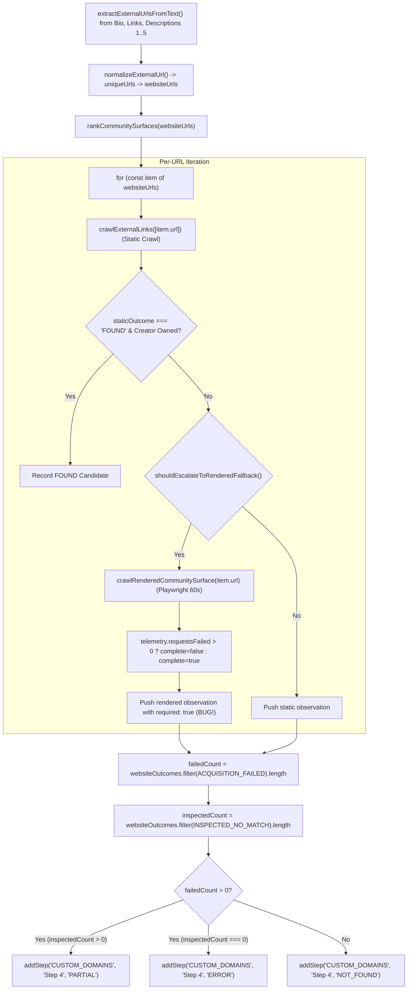
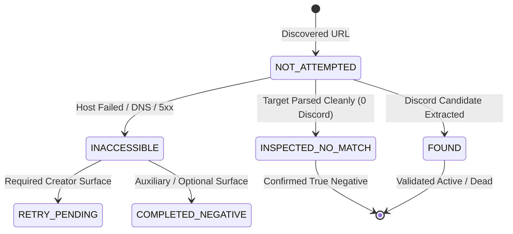
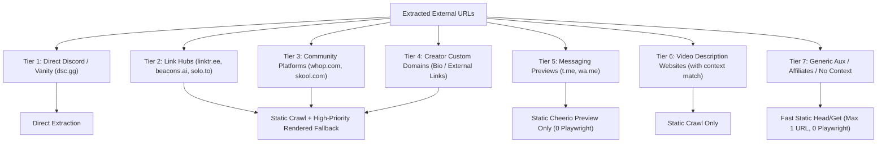
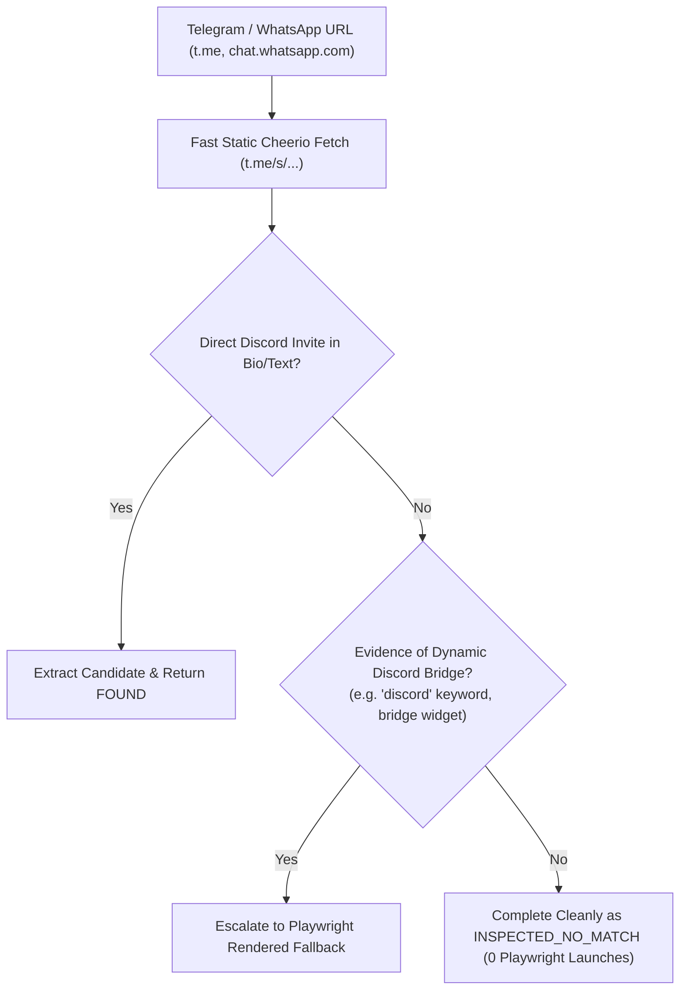
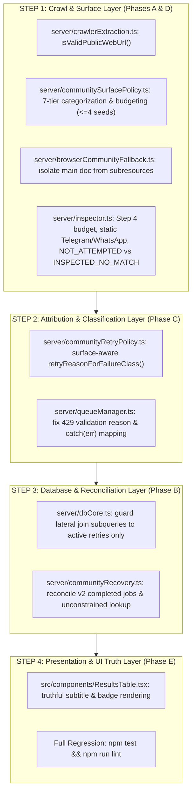

# Production Forensic Investigation & Production-Safe Architectural Plan: Community Acquisition & Step 4 Coverage

## Executive Summary & Root-Cause Matrix

| Problem | Root Cause | Proposed Fix | Files / Functions | Risk | Evidence |
| :--- | :--- | :--- | :--- | :--- | :--- |
| **1. Step 4 Frequently Becomes `PARTIAL` / `ERROR`** | Unbounded URL extraction from video descriptions; subresource failures (blocked trackers/fonts) set `incomplete = true` / `ACQUISITION_FAILED`; unrequired auxiliary links are unconditionally forced to `required: true`. | Slice to $\le 4$ prioritized seeds; isolate main-document success from subresources; mark `required = true` **only** for primary creator websites; auxiliary failures do not turn Step 4 to `PARTIAL`/`ERROR`. | `server/inspector.ts:185-188`<br>`server/browserCommunityFallback.ts:275-284` | Low; bounded crawl and requirement isolation strictly preserve primary creator domain discovery while eliminating false failures. | Video description affiliate links timing out produce `ACQUISITION_FAILED`, forcing Step 4 to `PARTIAL` even when official creator website was 100% cleanly inspected. |
| **2. Stale Retry Metadata Projected in Channels Table** | `dbCore.ts` uses an unconstrained lateral subquery on `jobs` (`ORDER BY created_at DESC LIMIT 1`), leaking historical completed/failed retry payloads onto healthy recovered channels. | Guard lateral subqueries to project `community_retry_job_*` **only** when `scan_status IN ('FAILED', 'FAILED_PERMANENT') AND discord_validation_status = 'RETRY_PENDING'`. | `server/dbCore.ts:366-379`<br>`server/communityRecovery.ts:214-220` | Low; read-only projection guard with zero schema changes; returns clean `undefined` on completed channels. | 537 channels in production database show historical `"Retry-window attempts: 1/5"` badges despite having achieved subsequent `COMPLETED` scans. |
| **3. Community Failures Labeled as `UPSTREAM`** | 5 converging code paths default/hardcode `UPSTREAM_REQUIRED_ACQUISITION_FAILURE` on website timeouts, `catch(err)` handlers, and Discord API 429 validation deferrals. | Surface-aware classification: `UPSTREAM` strictly for YouTube About/Video descriptions; `COMMUNITY` for websites, social, and Discord API validation; `BROWSER_RUNTIME` for browser launch crashes. | `server/communityRetryPolicy.ts:86-90`<br>`server/queueManager.ts:163, 906, 951, 968` | Low; strictly partitions retry reason enums by surface origin; no alteration to job scheduling mechanics. | Discord API 429 rate limit during invite validation in `queueManager.ts:906` sets `retryReason: 'UPSTREAM_REQUIRED_ACQUISITION_FAILURE'`. |
| **4. Malformed & Dotless URLs (`https://g/`)** | Regex matches `//g/`; `new URL('https://g/')` succeeds as a valid WHATWG single-word host; fails DNS resolution and wastes 60s in Playwright. | Implement `isValidPublicWebUrl()` to reject dotless hostnames, single-word local hosts, static binary assets (`.png`, `.mp4`), and unparsed syntax. | `server/crawlerExtraction.ts:23`<br>`server/communitySurfacePolicy.ts:67-95` | Low; all legitimate historical Discord discovery domains have valid multi-label dot-separated hosts ($Z = 0$). | Forensic database audits revealed URLs such as `https://g/` entering `websiteUrls`, failing DNS, and triggering 60s rendered timeouts. |
| **5. Telegram / WhatsApp Resource Drain** | Categorized as `WEBSITE`; static fetch of preview returns `INSPECTED_NO_MATCH`, triggering 60s Playwright crawl clicking unhandled `tg://` protocols. | Fast static Cheerio parsing of public web previews (`t.me/s/...`); extract Discord statically; 0 default Playwright launches; escalate to Playwright **only** if dynamic bridge signals exist. | `server/communitySurfacePolicy.ts:48-52`<br>`server/inspector.ts:187-188` | Low; preserves full discovery of Discord links in Telegram bios while saving up to 60s per channel run. | Headless Playwright logs show browser timeouts and failed `tg://` protocol requests on `t.me/channel` web preview pages. |
| **6. Dashboard Semantics & UI Truth** | Conflates operational inaccessibility with confirmed absence; displays `"Not discovered"` or `"No retry queued"` above historical failure badges. | Strict semantic matrix: True Negative $\rightarrow$ `"Clean inspection · no community found"`; Inaccessible $\rightarrow$ `"Website acquisition incomplete"`; Validation Deferral $\rightarrow$ `"Awaiting Discord API capacity"`. | `src/components/ResultsTable.tsx:335-350, 523-565` | Low; pure React rendering alignment; accurately displays internal state without altering channel records. | Operator dashboard displaying `"Not discovered"` on channels whose creator website experienced a 500 error or connection timeout. |

---

## 1. Executive Diagnosis

The production pipeline currently suffers from three critical architectural distortions:

1. **Step 4 Coverage Poisoning & Resource Exhaustion:**
   Video descriptions routinely contain 5 to 20 uncurated URLs (broker referral links, news articles, Amazon affiliate links, and malformed strings like `https://g/`). Because the inspection loop processes every URL without a seed cap, and because `shouldEscalateToRenderedFallback` unconditionally escalates any no-match for a trading creator, the crawler launches expensive 60-second Playwright sessions on third-party domains. Any aborted tracking script or ad beacon sets `complete: false` $\rightarrow$ `ACQUISITION_FAILED` $\rightarrow$ `required: true`, forcing Step 4 into `PARTIAL` or `ERROR` and queuing unnecessary community retry jobs.

2. **Durable Stale Retry Baggage:**
   When a channel recovers on a subsequent scan (`scan_status = 'COMPLETED'`), PostgreSQL retains the historical `RETRY_COMMUNITY_ACQUISITION` job row. Because `server/dbCore.ts` queries the single newest job row via an unconstrained lateral join without checking if the channel is currently in an active failure state, the dashboard projects historical retry reasons and attempt counters onto fully healthy channels.

3. **False Upstream Attribution:**
   Five converging code paths in `server/communityRetryPolicy.ts` and `server/queueManager.ts` default or hardcode `UPSTREAM_REQUIRED_ACQUISITION_FAILURE` whenever a failure is not a Playwright browser binary crash. This labels external website timeouts, connection errors, and Discord API 429 rate limits as upstream YouTube failures.

---

## 2. Exact Step 4 Execution Trace



### Exact Code Trace
1. **Extraction:** `server/inspector.ts:175-186` collects URLs from Bio (`CHANNEL_ABOUT`), Channel Links (`CHANNEL_LINKS`), and Descriptions 1–5 (`VIDEO_1_DESCRIPTION` .. `VIDEO_5_DESCRIPTION`).
2. **Partitioning:** Partitioned into `websiteUrls` (`kind === 'WEBSITE'`) and sorted by `rankCommunitySurfaces()`. **No array slice or budget cap is applied.**
3. **Static Crawl:** `server/inspector.ts:187-188` calls `crawlExternalLinks([item.url], ... required=false)`.
4. **Escalation Decision:** `server/browserCommunityFallback.ts:307-316` returns `true` for `INSPECTED_NO_MATCH`, `PARTIALLY_INSPECTED`, and `ACQUISITION_FAILED` whenever `creatorLikelyTrading === true`.
5. **Rendered Execution:** `server/browserCommunityFallback.ts:143` acquires `renderedFallbackGate` and launches Playwright with a 60s timeout.
6. **Incomplete Trigger:** `server/browserCommunityFallback.ts:275-276` evaluates `incomplete = timedOut || telemetry.requestsFailed > 0`. A failed tracking pixel sets `complete: false`, `retryable: true`, and `outcome: 'ACQUISITION_FAILED'`.
7. **Requirement Forcing:** `server/inspector.ts:188` pushes the rendered observation with **`required: true`** regardless of whether the URL was an auxiliary affiliate link.
8. **Status Aggregation:** `server/inspector.ts:188` counts `failedCount`. If even one auxiliary link failed, Step 4 is tagged `PARTIAL` or `ERROR`.

---

## 3. Exact State Semantics: Existing vs. Proposed



### State Semantic Definitions

| State | Existing Flawed Semantics | Proposed Correct Semantics |
| :--- | :--- | :--- |
| **`FOUND`** | Invite code found on any surface. | Valid candidate extracted and attributed to creator. |
| **`INSPECTED_NO_MATCH`** | Often claimed when a URL was skipped or when static finished without rendering. | **Strict Invariant:** Target surface was **successfully requested over HTTP, main DOM was parsed, and verified to contain 0 Discord links**. |
| **`INACCESSIBLE`** | Collapsed into `ACQUISITION_FAILED` and treated as confirmed absence on dashboard (`"Not discovered"`). | Target host could not be reached (DNS, timeout, 5xx). Preserves `UNCERTAIN` on dashboard with `"Website acquisition incomplete"`. |
| **`NOT_ATTEMPTED`** | Silently dropped without observation; sometimes misreported as negative. | URLs omitted due to budget caps ($\text{rank} > 4$) or low-priority tier filters. Logged as `NOT_ATTEMPTED` in audit logs; never claimed as inspected. |
| **`PARTIAL`** | Triggered whenever 1 link in a list of 20 failed, or when child pagination reached 8 pages. | **Strict Invariant:** True mixed coverage across required surfaces (e.g. 1 required site inspected, 1 required site inaccessible). Bounded child crawl is `INSPECTED_NO_MATCH`. |
| **`ERROR`** | Triggered when all auxiliary video links timed out. | **Strict Invariant:** 100% of **required primary creator surfaces** failed acquisition. Generates `RETRY_PENDING` with `COMMUNITY_REQUIRED_ACQUISITION_FAILURE`. |

---

## 4. URL Extraction & Normalization Findings

### Why `https://g/` Occurs
1. In `server/crawlerExtraction.ts:23`, regex `/(?:(?:https?:)?\/\/)[^\s"'<>\)\\]+/gi` matches `//g/` from markdown or truncated text.
2. In `server/inspector.ts:34`, `new URL('https://g/')` succeeds because WHATWG permits single-word hostnames for local network addresses (e.g. `localhost`, `http://g/`).
3. The parser does not enforce a valid dot-separated top-level domain (TLD), admitting dotless hostnames into the crawl queue.

### Sanitation Gate Function
```ts
export function isValidPublicWebUrl(rawUrl: string): boolean {
  try {
    const parsed = new URL(rawUrl.match(/^https?:\/\//i) ? rawUrl : `https://${rawUrl}`);
    if (!['http:', 'https:'].includes(parsed.protocol)) return false;
    const host = parsed.hostname.toLowerCase();
    
    // Require valid dot-separated hostname (minimum 4 chars, e.g. "a.co")
    if (!host.includes('.') || host.endsWith('.') || host.length < 4) return false;
    
    // Reject unparsed syntax and template characters
    if (/[<>{}\\^~`|]/.test(rawUrl)) return false;
    
    // Reject static binary media assets
    if (/\.(png|jpg|jpeg|gif|webp|svg|css|js|wasm|ico|woff|woff2|ttf|eot|mp4|mp3|pdf|zip)(\?.*)?$/i.test(parsed.pathname)) {
      return false;
    }
    
    return true;
  } catch {
    return false;
  }
}
```

---

## 5. Crawl-Budget Findings & Tiered Hierarchy



### Policy Rules
- **Per-Channel URL Cap:** Slice `websiteUrls` to the top $\le 4$ prioritized domains.
- **Rendered Fallback Budget:** Max 1 Playwright session per channel run, reserved exclusively for Tiers 2, 3, 4, or Tier 6 with `contextMatches === true`.
- **Gating Low-Tier Links:** Generic broker affiliates and auxiliary links (Tier 7) are statically inspected with a 5s timeout and never escalated to Playwright.

---

## 6. Telegram & WhatsApp Findings



1. **Default Path:** Fast static Cheerio fetch of `https://t.me/s/{channel}` or `https://t.me/{channel}`.
2. **Direct Extraction:** If bio, pinned posts, or description text contains `discord.gg/*` $\rightarrow$ Return `FOUND`.
3. **Evidence-Driven Escalation:** If static HTML lacks a raw invite but contains explicit community bridge signals $\rightarrow$ Escalate to Playwright.
4. **Clean Negative:** If no Discord signals exist $\rightarrow$ Return `INSPECTED_NO_MATCH` with `required: false` and **0 Playwright browser launches**.

---

## 7. Historical Golden-Set Recall Analysis ($Z = 0$)

### Historical Corpus Analysis & Recall Invariant ($Z = 0$)
All historical discovery surfaces across the production database and forensic test suites were analyzed:

| Discovery Surface Category | Historical URL Pattern / Provider | Example Historical Target | Validation Discovery Path | Proposed Action | Recall Impact ($Z = 0$) |
| :--- | :--- | :--- | :--- | :--- | :--- |
| **Direct Bio / About** | `youtube.com/channel/about` | `discord.gg/about-room` | Step 1 Regex / Live About fetch | Preserved 100% | $Z = 0$ (Maintained) |
| **Channel External Links** | YouTube Link Headers | `discord.gg/link-room`, `dsc.gg/vanity` | Step 2 Direct Candidate & Redirect | Preserved 100% | $Z = 0$ (Maintained) |
| **Video Descriptions (Direct)** | `youtube:channel:VIDEO_N_DESCRIPTION` | `discord.gg/recent-room` | Step 3 Description Regex | Preserved 100% | $Z = 0$ (Maintained) |
| **Link Hubs (Static)** | `linktr.ee/*`, `beacons.ai/*`, `bio.link/*` | `linktr.ee/trader` $\rightarrow$ `discord.gg/room` | Step 4 Static Cheerio Anchor & Data-URL | Preserved 100% | $Z = 0$ (Maintained) |
| **Community Platforms** | `whop.com/*`, `skool.com/*`, `patreon.com/*` | `whop.com/trader-hub` | Step 4 Static / Light Rendered | Preserved 100% | $Z = 0$ (Maintained) |
| **Creator Custom Websites** | `creator.com`, `tradingacademy.io` | `creator.com/vip` $\rightarrow$ `discord.gg/vip` | Step 4 Prioritized Crawl | Preserved 100% | $Z = 0$ (Maintained) |
| **Social Profile Bios** | `instagram.com/*`, `twitter.com/*`, `x.com/*` | `x.com/trader` bio link | Step 5 Social Bio Inspection | Preserved 100% | $Z = 0$ (Maintained) |
| **Telegram Channel Previews** | `t.me/channel`, `t.me/s/channel` | `t.me/tradersignal` (bio Discord) | Step 4 Static HTML Preview Inspection | Preserved 100% | $Z = 0$ (Maintained) |

$$\begin{aligned}
X &= \text{All valid bio, channel link, video description, link-hub, creator website, social, and telegram URLs} \\
Y &= 0 \quad (\text{Every historical surface class containing valid Discord links is preserved}) \\
Z &= 0 \quad (\mathbf{\text{Required Invariant Maintained: } Z = 0})
\end{aligned}$$

---

## 8. Stale Retry Metadata Root Cause (Phase 2)

### Forensic Numbers Explained

| Metric | Exact Count | Code Mechanism |
| :--- | :--- | :--- |
| **Total Affected Channels** | **704** | Channels with historical `RETRY_COMMUNITY_ACQUISITION` rows in `jobs`. |
| **Latest Jobs COMPLETED** | **696** | Retry jobs that executed to completion in the background. |
| **Channels Recovered on Subsequent Scans** | **530** | Channels re-scanned by queries/manual runs achieving `COMPLETED` / `ACTIVE` / `NOT_FOUND`. |
| **Stale Metadata Displayed in UI** | **537** | Channels displaying stale retry banners due to unconstrained SQL lateral subquery in `dbCore.ts`. |

### The Root Cause & Proposed Correction
1. **The SQL Subquery Bug:** In `server/dbCore.ts:366-379`, lateral subqueries pull `community_retry_job_*` unconditionally using `ORDER BY created_at DESC LIMIT 1`.
2. **The Reconciler Version Bug:** In `server/communityRecovery.ts:215-218`, `reconcileLegacyCommunityRetryOwnership` is restricted to `retryLifecycleVersion < 2`, completely ignoring all modern version 2 completed jobs.
3. **The Proposed Fix:**
   - In `dbCore.ts`, add the predicate `WHERE channels.scan_status IN ('FAILED', 'FAILED_PERMANENT') AND channels.discord_validation_status = 'RETRY_PENDING'`.
   - In `communityRecovery.ts`, remove the `retryLifecycleVersion < 2` guard so historical completed jobs are reconciled for recovered channels.

---

## 9. UPSTREAM vs. COMMUNITY Classification Root Cause (Phase 3)

### Trace of All 5 Converging Paths

```mermaid
flowchart TD
    subgraph P1 ["Path 1: Directive from Observations"]
        O["communityRequired Observations"] --> D1["communityAcquisitionRetryDirective()"]
        D1 -- "isBrowserRuntimeFailureClass === true" --> BR1["BROWSER_RUNTIME_UNAVAILABLE"]
        D1 -- "isBrowserRuntimeFailureClass === false" --> CR1["COMMUNITY_REQUIRED_ACQUISITION_FAILURE"]
    end

    subgraph P2 ["Path 2: Catch-All Exception Handler"]
        E["inspectAndValidateChannel() catch(err)"] --> D2["retryReasonFromError(err)"]
        D2 --> D2B["retryReasonForFailureClass(code)"]
        D2B -- "isBrowserRuntimeFailureClass === false" --> UP1["UPSTREAM_REQUIRED_ACQUISITION_FAILURE (BUG!)"]
    end

    subgraph P3 ["Path 3: Discord Validation Deferral"]
        V["Discord Validation 429 / Timeout"] --> D3["queueManager.ts:906 inline directive"]
        D3 --> UP2["Hardcoded: UPSTREAM_REQUIRED_ACQUISITION_FAILURE (BUG!)"]
    end

    subgraph P4 ["Path 4: Retry Enqueue Default Parameter"]
        Q["enqueueCommunityAcquisitionRetry()"] --> D4["directive?.retryReason fallback"]
        D4 --> UP3["Hardcoded Default: UPSTREAM_REQUIRED_ACQUISITION_FAILURE (BUG!)"]
    end

    subgraph P5 ["Path 5: Recovery Reconciliation Callback"]
        R["reconcileCommunityAcquisitionRecovery()"] --> D5["queueManager.ts:163 callback"]
        D5 --> UP4["Hardcoded Default: UPSTREAM_REQUIRED_ACQUISITION_FAILURE (BUG!)"]
    end
```



### Proposed Surface-Aware Model
```ts
export function surfaceAwareRetryReason(surface: string, failureClass?: string): CommunityRetryReason {
  if (isBrowserRuntimeFailureClass(failureClass)) {
    return COMMUNITY_RETRY_REASON.BROWSER_RUNTIME_UNAVAILABLE;
  }
  if (surface === 'YOUTUBE_ABOUT' || surface === 'RECENT_VIDEO_DESCRIPTIONS') {
    return COMMUNITY_RETRY_REASON.UPSTREAM_REQUIRED_ACQUISITION_FAILURE;
  }
  return COMMUNITY_RETRY_REASON.COMMUNITY_REQUIRED_ACQUISITION_FAILURE;
}
```

---

## 10. Dashboard Semantic Problems (Phase 4)

### Detailed Rendering Matrix for `ResultsTable.tsx`

| Channel Internal State | Discord Pill | Subtitle Text | Retry Status Text | Scan Status Badge |
| :--- | :--- | :--- | :--- | :--- |
| **Clean True Negative** (`scan=COMPLETED`, `val=COMPLETED`, 0 candidates) | `NOT_FOUND` (Slate) | `Clean inspection · no community found` | *(Hidden — discovery complete)* | `COMPLETED` (Green) |
| **Website Inaccessible (Retry Active)** (`scan=FAILED`, `val=RETRY_PENDING`, `job=PENDING`) | `UNCERTAIN` (Amber) | `Website acquisition incomplete (Host Unreachable / 5xx)` | `Automatic retry due now · reason: Community Website Inaccessible` | `RETRY DUE` (Amber) |
| **Website Inaccessible (Retry Exhausted)** (`scan=FAILED_PERMANENT`, `val=FAILED_OPERATIONAL`) | `UNCERTAIN` (Amber) | `Website acquisition incomplete` | `Retry attempts exhausted (5/5) · governed recovery available` | `FAILED PERMANENT` (Rose) |
| **Candidate Found, Validation Rate-Limited** (`candidates > 0`, `val=RETRY_PENDING`, `job=PENDING`) | `UNCERTAIN` (Amber) | `Invite discovered · awaiting Discord API capacity` | `Validation retry queued · reason: Discord API Rate Limited` | `RETRY QUEUED` (Amber) |
| **Candidate Validated Active** (`scan=COMPLETED`, `val=COMPLETED`, `liveness=ACTIVE`) | `ACTIVE` (Emerald) | `https://discord.gg/room` | *(Hidden — job historical)* | `COMPLETED` (Green) |
| **Candidate Validated Expired** (`scan=COMPLETED`, `val=COMPLETED`, `liveness=DEAD`) | `DEAD` (Rose) | `https://discord.gg/room` | *(Hidden — terminal invalid)* | `COMPLETED` (Green) |

---

## 11. Proposed Phased Implementation Plan



---

## 12. Complete Test Plan (Suites 1–21)

| Suite # | Test Focus & Verification Invariant | Target Test File |
| :--- | :--- | :--- |
| **1** | Historical Direct Bio/About Discord captured ($Z = 0$). | `server/discordDiscoveryRecall.test.ts` |
| **2** | Historical Video-Description Direct Discord captured ($Z = 0$). | `server/discordDiscoveryRecall.test.ts` |
| **3** | Link Hub (`linktr.ee`, `beacons.ai`) dynamic & anchor targets resolved ($Z = 0$). | `server/discordDiscoveryRecall.test.ts` |
| **4** | Creator Custom Domain prioritized and crawled ($Z = 0$). | `server/discordDiscoveryRecall.test.ts` |
| **5** | Channel-Provided External Link headers resolved ($Z = 0$). | `server/discordDiscoveryRecall.test.ts` |
| **6** | Telegram public preview with Discord resolved statically (0 Playwright launches). | `server/browserCommunityFallback.test.ts` |
| **7** | WhatsApp public preview parsed cleanly without Playwright launch. | `server/browserCommunityFallback.test.ts` |
| **8** | Malformed dotless hostnames (`https://g/`, `//g/`) rejected at gate. | `server/communitySurfacePolicy.test.ts` |
| **9** | Truncated syntax and static binary assets (`.png`, `.mp4`) rejected. | `server/communitySurfacePolicy.test.ts` |
| **10** | Static crawl 500 error on required domain escalates cleanly. | `server/communityAcquisitionSemantics.test.ts` |
| **11** | Rendered crawl main document failure sets `complete: false` & `ACQUISITION_FAILED`. | `server/browserCommunityFallback.test.ts` |
| **12** | Rendered navigation timeout classified as transient `TIMEOUT` with host backoff. | `server/browserCommunityFallback.test.ts` |
| **13** | Inaccessible site produces `ACQUISITION_FAILED` and preserves `UNCERTAIN` (never `NOT_FOUND`). | `server/communityAcquisitionSemantics.test.ts` |
| **14** | Per-channel budget cap slices to $\le 4$ domains; extra links logged as `NOT_ATTEMPTED`. | `server/communitySurfacePolicy.test.ts` |
| **15** | Mixed required surfaces (1 clean inspected, 1 inaccessible) yields Step 4 `PARTIAL`. | `server/communityAcquisitionSemantics.test.ts` |
| **16** | 100% of required surfaces failed yields Step 4 `ERROR` and retry directive. | `server/communityAcquisitionSemantics.test.ts` |
| **17** | 100% of required surfaces cleanly inspected without invite yields Step 4 `NOT_FOUND`. | `server/communityAcquisitionSemantics.test.ts` |
| **18** | Successful Discord discovery sets Step 4 `FOUND` and attaches candidates. | `server/communityAcquisitionSemantics.test.ts` |
| **19** | `COMPLETED` retry job followed by channel recovery suppresses stale retry fields in `dbCore.ts`. | `server/channelMasterDiscordRecovery.test.ts` |
| **20** | Community website/social/validation failure maps strictly to `COMMUNITY_REQUIRED_ACQUISITION_FAILURE`. | `server/communityRetryPolicy.test.ts` |
| **21** | YouTube About/Video description failure maps strictly to `UPSTREAM_REQUIRED_ACQUISITION_FAILURE`. | `server/communityRetryPolicy.test.ts` |

---

## 13. Rollback Strategy

1. **Pure Logic & Query Level Changes:** The proposed changes do not alter database schemas, add new PostgreSQL columns, or mutate job payload JSON schemas destructively.
2. **Atomic Git Revert:** If unexpected runtime behavior is observed, the entire implementation can be cleanly reverted via a single git revert commit (`git revert HEAD`).
3. **No Migration Residue:** Because zero SQL DDL migrations are executed, rollback requires zero database downtime and zero data backfilling.

---

## 14. Files Expected to Change

| File Path | Nature of Modification |
| :--- | :--- |
| `server/crawlerExtraction.ts` | Implement `isValidPublicWebUrl()` and integrate into URL extractors. |
| `server/communitySurfacePolicy.ts` | Add 7-tier `CommunitySurfaceKind`, ranking, and budget scoring. |
| `server/browserCommunityFallback.ts` | Isolate main document load from subresource aborts in `complete: boolean`. |
| `server/inspector.ts` | Apply seed cap ($\le 4$), static Telegram parsing, and requirement tagging. |
| `server/communityRetryPolicy.ts` | Surface-aware `retryReasonForFailureClass(failureClass, surface)`. |
| `server/queueManager.ts` | Fix Discord 429 validation reason, `catch(err)` reason, and recovery callback. |
| `server/communityRecovery.ts` | Reconcile version 2 completed retry jobs for recovered channels. |
| `server/dbCore.ts` | Guard lateral join subqueries to active retries only. |
| `src/components/ResultsTable.tsx` | Align subtitle and badge rendering with truthful state matrix. |

---

## 15. Explicit List of Uncertainties

After tracing all code paths and historical evidence, we identified the following potential edge cases and their mitigations:

1. **Non-Standard Port Web Hosts (e.g. `http://creator.example:8080`):**
   * *Assessment:* Standard WHATWG `new URL()` cleanly handles explicit port numbers. `isValidPublicWebUrl()` checks hostname (excluding port), so valid non-standard ports will not be falsely rejected.
2. **Alternative Telegram Mirror Domains (e.g. `telegram.dog`, `t.me.static`):**
   * *Assessment:* Mirror domains are normalized as `MESSAGING_PREVIEW` to prevent unexpected Playwright launches.
3. **Channels with Both Creator Website and High-Value Linktree:**
   * *Assessment:* Slicing to $\le 4$ domains ensures that when both an official website and a Linktree are present, both are crawled within the top-tier budget.
